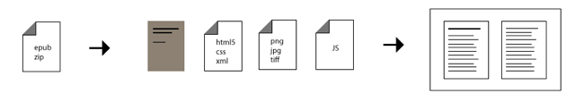

# Epub.js v0.3


Epub.js is a JavaScript library for rendering ePub documents in the browser, across many devices.

Epub.js provides an interface for common ebook functions (such as rendering, persistence and pagination) without the need to develop a dedicated application or plugin. Importantly, it has an incredibly permissive [Free BSD](https://en.wikipedia.org/wiki/BSD_licenses) license.

[Try it while reading Moby Dick](https://intity.github.io/epubreader-js/)

## Why EPUB



The [EPUB standard](https://www.w3.org/TR/epub/) is a widely used and easily convertible format. Many books are currently in this format, and it is convertible to many other formats (such as PDF, Mobi and iBooks).

An unzipped EPUB3 is a collection of HTML5 files, CSS, images and other media – just like any other website. However, it enforces a schema of book components, which allows us to render a book and its parts based on a controlled vocabulary.

More specifically, the EPUB schema standardizes the table of contents, provides a manifest that enables the caching of the entire book, and separates the storage of the content from how it’s displayed.

## Getting Started

If using archived `.epub` files include [JSZip](https://stuk.github.io/jszip/) (this must precede inclusion of **epub.js**):

```html
<script src="../dist/jszip.min.js"></script>
```

Get the minified code from the build folder:

```html
<script src="../dist/epub.min.js"></script>
```

Set up a element to render to:

```html
<div id="viewer"></div>
```

Create the new ePub, and then render it to that element:

```html
<script>
    const book = ePub("uri/to/book/package.opf")
    const rendition = book.renderTo("viewer", {
        width: 600,
        height: 400
    })
    const displayed = rendition.display()
</script>
```

## Render manager

### default

```js
book.renderTo("viewer", {
    manager: "default",
    width: "100%",
    height: "100%"
})
```

[View example](https://intity.github.io/epub-js/examples/paginated.html)

The default manager only displays a single section at a time.

### continuous

```js
book.renderTo("viewer", {
    manager: "continuous",
    width: "100%",
    height: "100%"
})
```

[View example](https://intity.github.io/epub-js/examples/scrolled-continuous.html)

The continuous manager will display as many sections as need to fill the screen, and preload the next section offscreen. This enables seamless swiping / scrolling between pages on mobile and desktop, but is less performant than the default method.

## Flow Overrides

### paginated (default)

Flow will be based on the settings in the OPF, defaults to `paginated`.

```js
book.renderTo("viewer", {
    flow: "paginated",
    width: 900,
    height: 600
})
```

[View example](https://intity.github.io/epub-js/examples/paginated.html)

### scrolled-doc

```js
book.renderTo("viewer", {
    flow: "scrolled-doc",
    pageWidth: 800
})
```

[View example](http://intity.github.io/epub-js/examples/scrolled-doc.html)

## Scripted Content

[Scripted content](https://www.w3.org/TR/epub/#sec-scripted-content), JavasScript the ePub HTML content, is disabled by default due to the potential for executing malicious content. 

This is done by sandboxing the iframe the content is rendered into, though it is still recommended to sanitize the ePub content server-side as well.

If a trusted ePub contains interactivity, it can be enabled by setting a `sandbox` option set in [Rendition](docs/API/rendition.md) settings.

```html
<script>
    const rendition = book.renderTo("viewer", {
        width: 600,
        height: 400,
        sandbox: ["allow-same-origin", "allow-scripts"]
    })
</script>
```

This will allow the sandboxed content to run scripts, but currently makes the sandbox insecure.

## Documentation

API documentation is available at [docs/index.md](docs/index.md)

## Running Locally

install **node.js**

Then install the project dependences with `npm`

```js
npm install
```

You can run the reader locally with the command

```js
npm run start
```

## Examples

All source code for the examples is located in the [examples](examples/) subdirectory of this repository. However, not all examples are working. Some of them may be outdated. A list of working examples can be found in the [examples/index.html](https://intity.github.io/epub-js/examples/) document.

## Testing

The [mocha](https://mochajs.org/) framework is used for unit testing. All tests are performed in the browser console. First, you need to start the local server with the following command:

```js
npm run start
```

Then open the page in the browser at: http://localhost:8080/test/

Finally, open the browser console to see the test results.

## Building for Distribution

Builds are concatenated and minified using [webpack](https://webpack.js.org/) and [babel](https://babeljs.io/)

To generate a new build run

```js
npm run prepare
```

or to continuously build run

```js
npm run watch
```

## Hooks

Similar to a plugins, **epub.js** implements events that can be "hooked" into. Thus you can interact with and manipulate the contents of the book.

Examples of this functionality is loading videos from YouTube links before displaying a chapter's contents or implementing annotation.

Hooks require an event to register to and a can return a promise to block until they are finished.

Example hook:

```js
rendition.hooks.content.register((contents, view) => {

    const items = contents.document.querySelectorAll("[video]")

    items.forEach((item) => {
        // do something with the video item
    })
})
```

The parts of the rendering process that can be hooked into are below.

```js
book.spine.hooks.serialize // Section is being converted to text
book.spine.hooks.content // Section has been loaded and parsed
rendition.hooks.render // Section is rendered to the screen
rendition.hooks.content // Section contents have been loaded
rendition.hooks.unloaded // Section contents are being unloaded
```

## Reader
The reader has moved to its own repo at: [epubreader-js](https://github.com/intity/epubreader-js/)