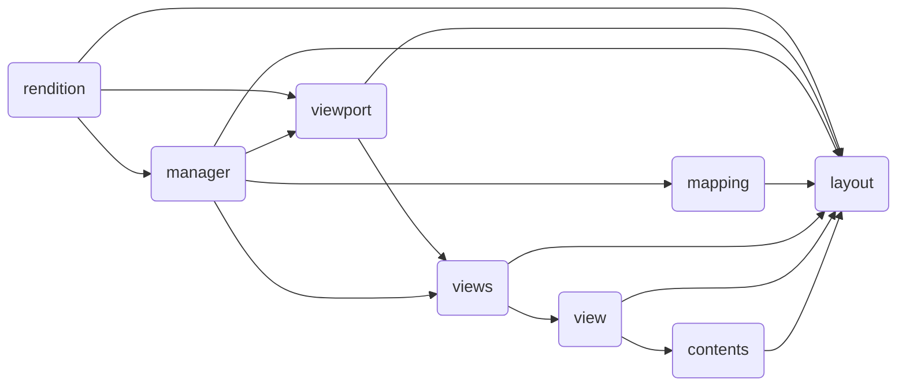
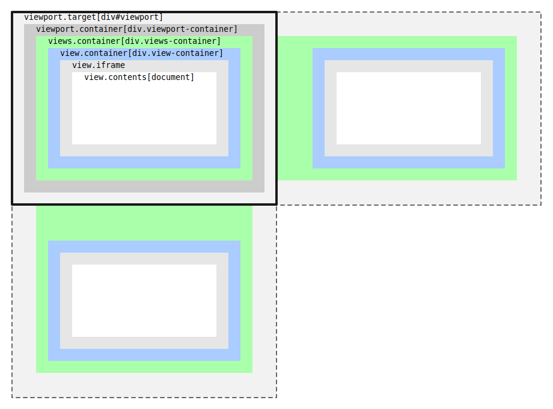
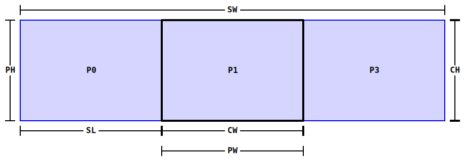
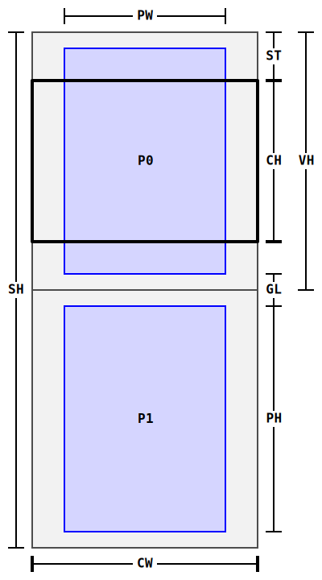
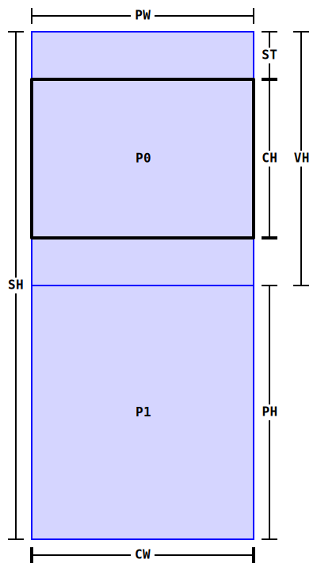

# Rendering system architecture

**Document status:** draft

The architecture of the rendering system contains many abstractions that help solve complex problems. In particular, customizing the layout of pages in different views. The central place in the rendering system is occupied by the [Layout](API/layout.md) class, which provides the basic infrastructure for performing derivative calculations. Below is a graph of dependencies on the **layout** object.



Most of the dependent objects rely on the `layout.updated` event to finish synchronizing with the current state of the `layout` object. The `layout` object itself depends on the `viewport.resized` event. This happens every time the **viewport-container** is resized. However, the `layout` object knows nothing about containers, since it is only intended for calculations. Containers are created and configured by the [Viewport](API/viewport.md) class. The following image should clarify the technical details.



First of all, this class must attach to the `div#viewport` element, in order to then wrap the `div.viewport-container` inside it. This, in turn, will fire the `viewport.resized` event, which will change the state of the `layout` object. Finally, the rendering process at the `manager` object level must be triggered.

## Horizontal axis

### rendition-flow-paginated

Configuration

```js
var rendition = book.renderTo("viewport", {
    axis: "horizontal", // default
    flow: "paginated", // default
    layout: "reflowable", // default
    spread: "none",
    width: "100%", // default
    height: "100%", // default
    manager: "default"
})
```

Designations

```
SW:viewport.container.scrollWidth
SL:viewport.container.scrollLeft
CW:layout.width = viewport.container.clientWidth
CH:layout.height = viewport.container.clientHeight
PW:layout.pageWidth = CW
PH:layout.pageHeight = CH
```



## Vertical axis

### rendotion-flow-scrolled-doc

Configuration

```js
var rendition = book.renderTo("viewport", {
    axis: "vertical", // autocomplete
    flow: "scrolled-doc",
    layout: "reflowable", // default
    spread: "none", // autocomplete
    width: "100%", // default
    height: "100%", // default
    manager: "continuous",
    pageWidth: 800
})
```

Designations

```
SH:viewport.container.scrollHeight
ST:viewport.container.scrollTop
CW:layout.width = viewport.container.clientWidth
CH:layout.height = viewport.container.clientHeight
PW:layout.pageWidth = 800
PH:layout.pageHeight = 0
GL:layout.gap
VH:view.contents.content.clientHeight
```



### rendition-flow-scrolled-continuous

Configuration

```js
var rendition = book.renderTo("viewport", {
    axis: "vertical", // autocomplete
    flow: "scrolled-continuous",
    layout: "reflowable", // default
    spread: "none", // autocomplete
    manager: "continuous",
    width: "100%", // default
    height: "100%" // default
})
```

Designations

```
SH:viewport.container.scrollHeight
ST:viewport.container.scrollTop
CW:layout.width = viewport.container.clientWidth
CH:layout.height = viewport.container.clientHeight
PW:layout.pageWidth = CW
PH:layout.pageHeight = CH
VH:view.contents.content.clientHeight
```

