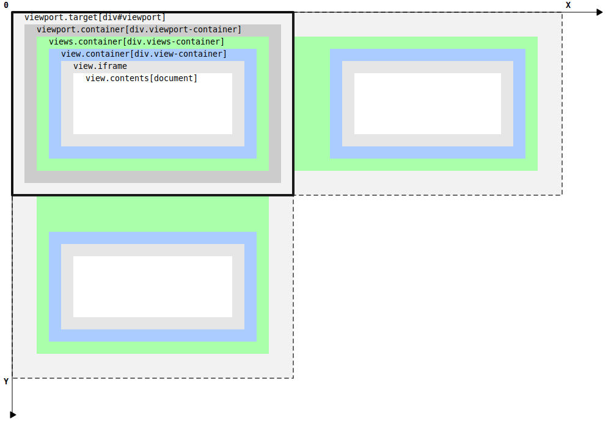

# Rendition.viewport

This section of the documentation describes the general characteristics of the `Rendition.viewport` component, whose primary purpose is to attach a **viewport** target element to the **epub.js** library infrastructure. The image below shows the nested structure of the DOM tree elements.

Essentially, the `div#viewport` element is a custom container against which all other construction will be performed. If necessary, you can also include controls in it.

The next element `div.viewport-container` is used as a container to hold `div.view-container` elements. Note that the default rendering configuration assumes only one current `div.view-container` element. This element will be updated when the location changes. However, when the `manager` option is set to `continuous` value in the rendering configuration, then `div.view-container` elements will be sequentially added to the `div.viewport-container`, in depending on the current location.
